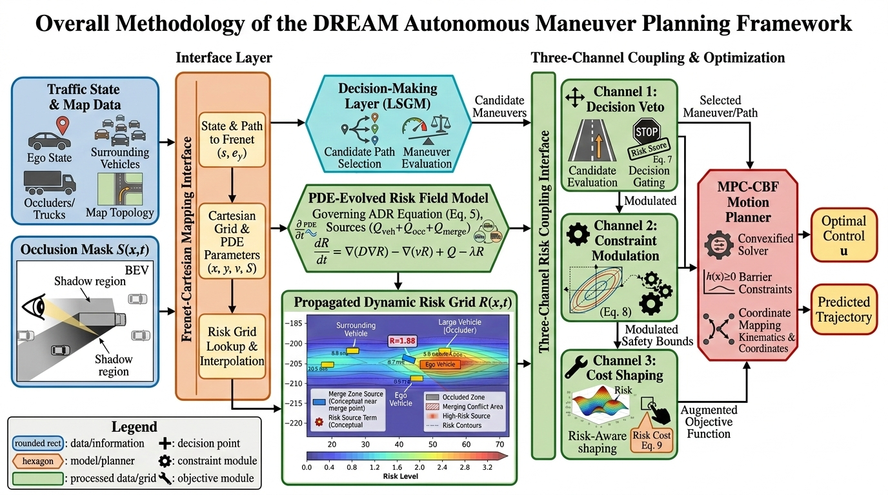
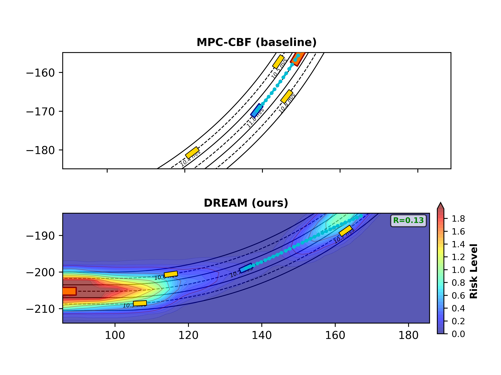
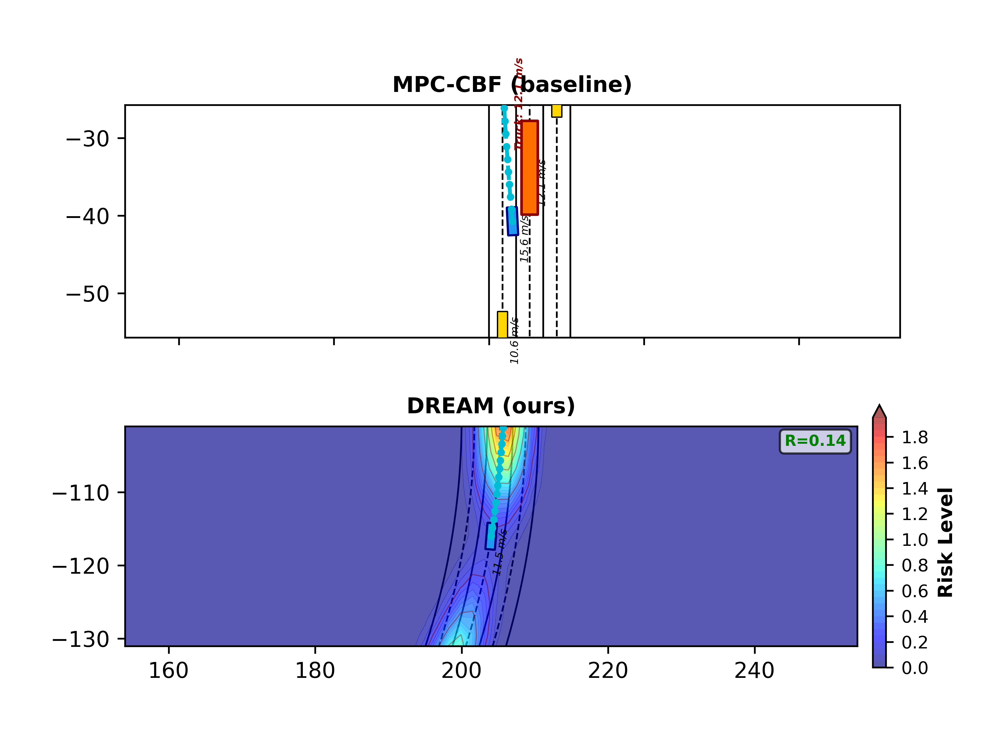
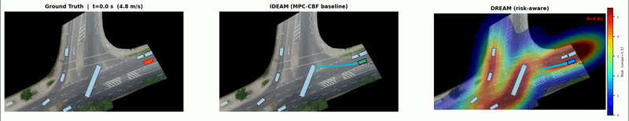

# DREAM: Defensive Risk-Aware Enhanced Autonomous Vehicles Maneuver Planning in Heterogeneous Traffic

This repository is built upon the [Risk Field Modeling Comparative Study](https://github.com/SAS-HKU/Riskfield_Benchmark.git) and [DRIFT](https://github.com/SAS-HKU/DRIFT.git): Dynamic Risk Inference via Field Transport for Human-like Autonomous Driving.


### proposed framework:




## 🚀 Quick Start

### Step 1: Install required packages; Run Visualization Simulation based on the BEV dataset trajectories

```bash
cd src
pip install -r requirements.txt
python drift_dataset_visualization.py
```

**Output:**
- Frames saved to `figsave_DRIFT_dataset/`

### Step 2: Create Video Animation

```bash
# You may change the file name every epoch you run the simulation and then save the video
python video_generation.py
```

### Step 3: Analyze Risk Data

```bash
python risk_analysis_utils.py figsave_risk_viz/risk_at_ego.npy
```

**Output:**
- `risk_timeline.png` - Risk over time with threshold lines
- `risk_histogram.png` - Distribution of risk levels
- `risk_analysis.png` - Comprehensive multi-panel analysis
- `risk_events.csv` - High-risk events exported to CSV

---

## 🎨 Customizing Visualization

### Option A: Use Presets (Easiest)

Edit `emergency_test_with_risk_viz.py`, add after imports:

```python
from risk_viz_config import RiskVizConfig as viz_cfg

# Choose a preset
viz_cfg.preset_subtle()      # Low-contrast, clean
viz_cfg.preset_dramatic()    # High-contrast, emphasizes risk
viz_cfg.preset_scientific()  # Publication-ready with colorbar
viz_cfg.preset_highcontrast() # For presentations

# Then replace hardcoded values
RISK_ALPHA = viz_cfg.RISK_ALPHA
RISK_CMAP = viz_cfg.RISK_CMAP
# ... etc
```

### Option B: Manual Tuning

Edit these variables in `emergency_test_with_risk_viz.py` (around line 140):

```python
RISK_ALPHA = 0.4         # Transparency (0.0-1.0)
RISK_CMAP = 'hot'        # Colormap: 'hot', 'YlOrRd', 'plasma', 'inferno'
RISK_LEVELS = 15         # Number of contour levels
RISK_VMAX = 3.0          # Max risk value for color scale
SHOW_CONTOUR = True      # Show contour lines?
SHOW_HEATMAP = True      # Show filled heatmap?
```

**Colormap Options:**
- `'hot'` - Black → Red → Yellow → White (classic heat)
- `'YlOrRd'` - Yellow → Orange → Red (warning colors)
- `'Reds'` - White → Red (simple gradient)
- `'plasma'` - Purple → Pink → Yellow (perceptually uniform)
- `'inferno'` - Black → Purple → Orange → Yellow
- `'RdYlGn_r'` - Red → Yellow → Green (reversed)

---

## 📊 Understanding the Risk Field

### DRIFT Risk Sources

The risk field combines three sources:

1. **Vehicle-Induced Risk** (Anisotropic Gaussian kernels)
   - Higher in front of moving vehicles (direction of travel)
   - Decays with distance
   - Intensity scales with relative velocity

2. **Occlusion-Induced Risk** (Shadow regions)
   - Elevated behind large vehicles (trucks, trailers)
   - Represents hidden hazards in sensor blind spots
   - Propagates based on uncertainty

3. **Merge Pressure** (Topological conflicts)
   - High in lane-change zones
   - Elevated where lanes converge
   - Captures structural road geometry risks

### Risk Propagation Dynamics

- **Advection**: Risk flows with traffic
- **Diffusion**: Risk spreads spatially (uncertainty)
- **Telegraph term**: Finite propagation speed (wave-like)

---

## 🔍 Interpreting Results

### High Risk Scenarios

You should see elevated risk (red zones) in:

1. **Dense traffic** - Multiple vehicles close together
2. **Behind large vehicles** - Occlusion shadows
3. **Lane change maneuvers** - Merge pressure zones
4. **Emergency braking** - Sudden deceleration events

### Analysis Metrics

- **Mean Risk**: Average exposure level
- **Peak Risk**: Maximum risk encountered
- **Time in High Risk**: Duration above threshold
- **Risk Events**: Discrete high-risk episodes

---

## 📐 Technical Details

### Simulation Parameters

- **Grid**: From `config.py` (default: 400m × 60m, 1m resolution)
- **PDE Substeps**: 3 (for numerical stability)
- **Timestep**: 0.1s (matches IDEAM)
- **Horizon**: 400 timesteps (40 seconds)

### Performance

- **Frame generation**: ~2-3 seconds per frame (depends on grid size)
- **Full simulation**: ~15-20 minutes for 400 frames
- **Memory**: ~500MB for storing risk fields (if enabled)
---

## 📈 Example Workflow

### 1) Emergency highway scenario (synthetic)
```bash
python emergency_test_prideam.py \
  --integration-mode conservative \
  --steps 120 \
  --scenario-file file_save/120_100 \
  --save-dir outputs/emergency_run01 \
  --save-dpi 300 \
  --save-frames true
```

### 2) Uncertainty merger scenario (synthetic)
```bash
python uncertainty_merger_DREAM.py \
  --integration-mode conservative \
  --steps 120 \
  --save-dir outputs/uncertainty_merger_run01 \
  --save-dpi 300 \
  --save-frames true
```

### 3) Dataset benchmark (rounD/inD replay)
```bash
python dream_dataset_benchmark.py \
  --dataset-dir data/rounD \
  --recording-id 01 \
  --ego-track-id 254 \
  --save-dir outputs/dataset_benchmark_run01 \
  --steps 120 \
  --integration-mode conservative \
  --save-frames true \
  --frame-dpi 150
```

### Optional: frame sequence to MP4
```bash
python video_generation.py \
  --image-folder outputs/dataset_benchmark_run01 \
  --video-name outputs/dataset_benchmark_run01/benchmark.mp4 \
  --fps 20
```

## Demonstrations:


demonstration of LC for emergency vehicle with safety-critical considerations ([IDEAM](https://github.com/YimingShu-teay/IDEAM.git)-based planning).


Compared with the baseline planner, DREAM enables the ego stay away from the agent group ahead and find the appropriate spaces with no agents around, where the risk score is minimal. However, the progress was sacrificed.


The baseline planner forced the ego to perform very aggressive and dangerous overtaking (LC to the left) and nearly collide with the rear of the truck-trailer ahead. Instead, DREAM shows a more conservative planning that better aware of the risk from the truck-trailer and the uncertainty.



We compare the trajectories of (1): the ground truth ego trajectories from BEV datasets; (2): the baseline planner trajectories; (3): the DREAM planner trajectories.
The results show that baseline planner is over aggressive as near collision with the truck rear, and our planner is more conservative but sacrifice the progress. (The selected scenario include the occlusion-aware planning from the truck-trailer that may block the visibility of the ego)

## Acknowledgement:
The BEV dataset visualizations:
[dron-dataset-tools](https://github.com/ika-rwth-aachen/drone-dataset-tools.git)

The baseline planner:
[IDEAM](https://github.com/YimingShu-teay/IDEAM.git)
Corresponding paper:
```
@article{shu2025agile,
  title={Agile Decision-Making and Safety-Critical Motion Planning for Emergency Autonomous Vehicles},
  author={Shu, Yiming and Zhou, Jingyuan and Zhang, Fu},
  journal={IEEE Transactions on Intelligent Transportation Systems},
  year={2025},
  publisher={IEEE}
}
```
The baseline APF modeling:
Corresponding paper:
```
@inproceedings{rasidescu2024artificial,
  title={Artificial Potential Fields-Enhanced Socially Intelligent Path-Planning for Autonomous Vehicles Using Type 2 Fuzzy Systems},
  author={Rasidescu, Victor and Taghavifar, Hamid},
  booktitle={2024 IEEE 27th International Conference on Intelligent Transportation Systems (ITSC)},
  pages={2599--2605},
  year={2024},
  organization={IEEE}
}
```

(Referenced coding package: [Artificial-Potential-Field](https://github.com/liuxuexun/Artificial-Potential-Field.git))

The baseline GVF modeling:
```
@article{zhang2021spatiotemporal,
  title={Spatiotemporal learning of multivehicle interaction patterns in lane-change scenarios},
  author={Zhang, Chengyuan and Zhu, Jiacheng and Wang, Wenshuo and Xi, Junqiang},
  journal={IEEE Transactions on Intelligent Transportation Systems},
  volume={23},
  number={7},
  pages={6446--6459},
  year={2021},
  publisher={IEEE}
}
```

The baseline assymetric driving aggressiveness modeling:
```
@article{hu2025socially,
  title={Socially Game-Theoretic Lane-Change for Autonomous Heavy Vehicle based on Asymmetric Driving Aggressiveness},
  author={Hu, Wen and Deng, Zejian and Yang, Yanding and Zhang, Pingyi and Cao, Kai and Chu, Duanfeng and Zhang, Bangji and Cao, Dongpu},
  journal={IEEE Transactions on Vehicular Technology},
  year={2025},
  publisher={IEEE}
}
@article{deng2024eliminating,
  title={Eliminating uncertainty of driver’s social preferences for lane change decision-making in realistic simulation environment},
  author={Deng, Zejian and Hu, Wen and Sun, Chen and Chu, Duanfeng and Huang, Tao and Li, Wenbo and Yu, Chao and Pirani, Mohammad and Cao, Dongpu and Khajepour, Amir},
  journal={IEEE Transactions on Intelligent Transportation Systems},
  year={2024},
  publisher={IEEE}
}
```
