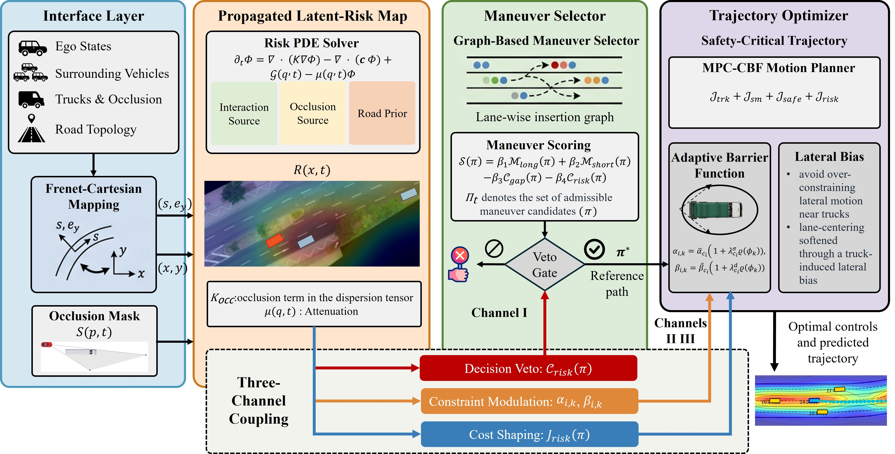
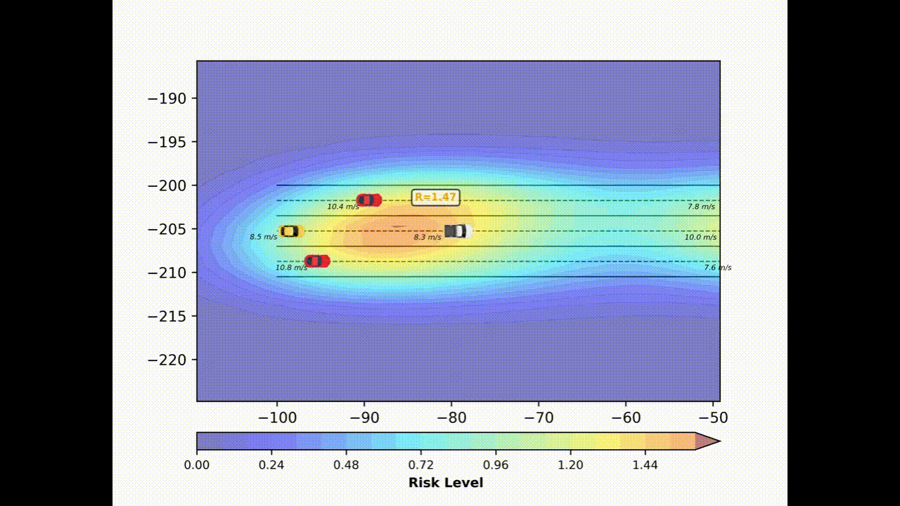
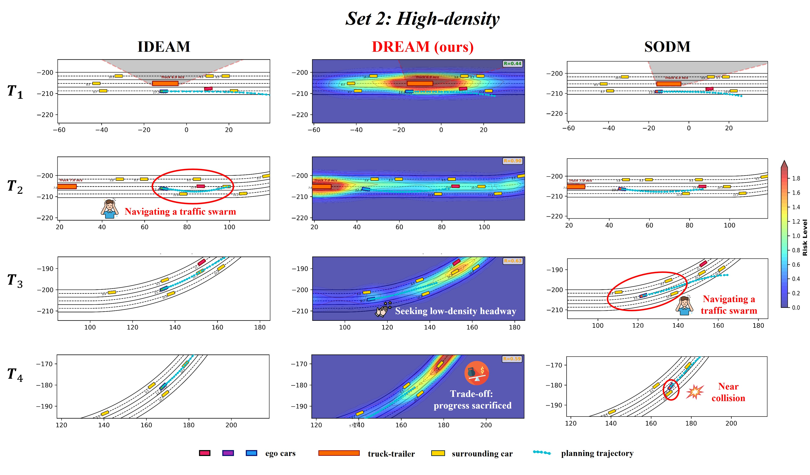
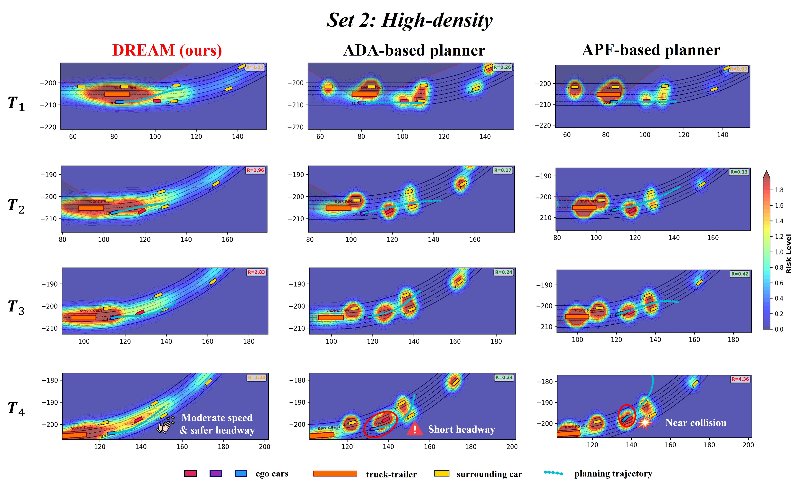
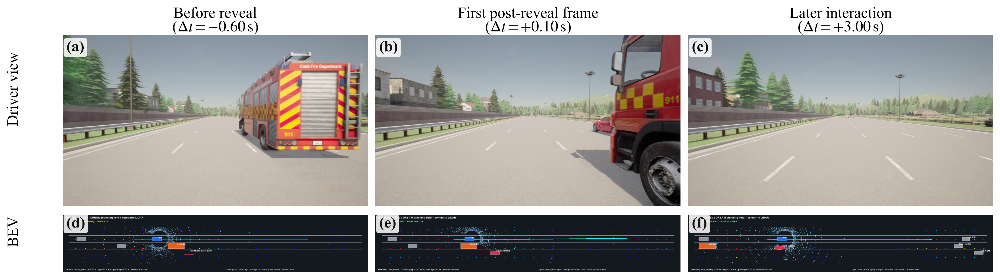
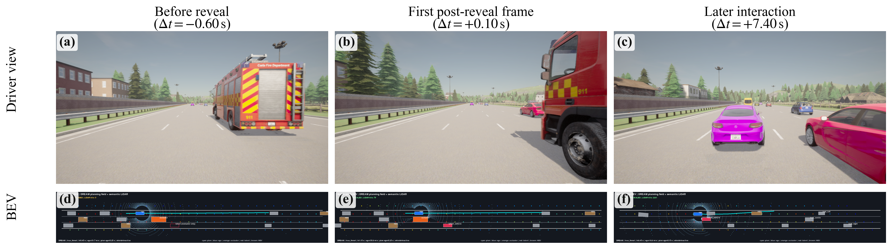
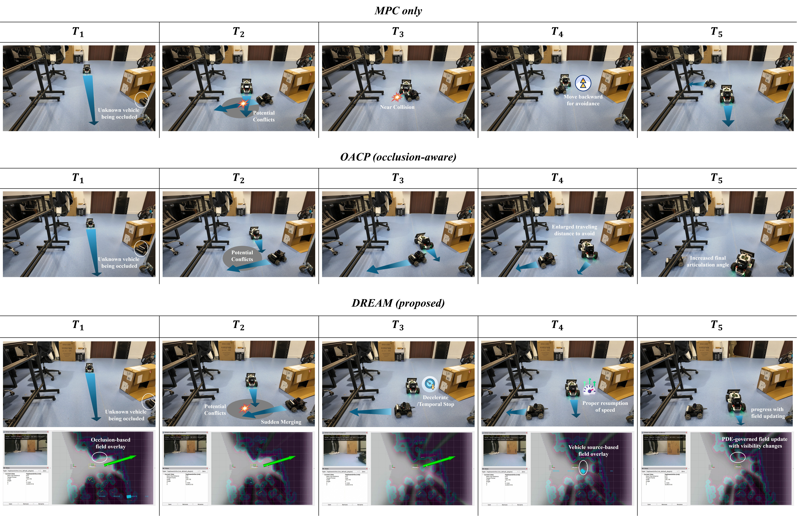

# DREAM: Defensive Risk-Aware Enhanced Maneuver Planning for Autonomous Vehicles in Heterogeneous Traffic
DREAM is an occlusion-aware, safety-critical planning framework that couples dynamic PDE risk transmission with maneuver-level decision-making and MPC-CBF control, explicitly capturing heavy-vehicle asymmetry and blind-zone hazards in heterogeneous traffic.

Preliminary risk field modeling is based on [DRIFT](https://github.com/SAS-HKU/DRIFT.git): Dynamic Risk Inference via Field Transmission for Human-like Autonomous Driving.

### proposed framework:




## 🚀 Quick Start

### Step 1: Install required packages; Run Visualization Simulation based on the BEV dataset trajectories

```bash
cd src
pip install -r requirements.txt
python drift_dataset_visualization.py
```

**Output:**
- Frames saved to `figsave_DRIFT_dataset/`

### Step 2: Create Video Animation

```bash
# You may change the file name every epoch you run the simulation and then save the video
python video_generation.py
```

### Step 3: Analyze Risk Data

```bash
python risk_analysis_utils.py figsave_risk_viz/risk_at_ego.npy
```

**Output:**
- `risk_timeline.png` - Risk over time with threshold lines
- `risk_histogram.png` - Distribution of risk levels
- `risk_analysis.png` - Comprehensive multi-panel analysis
- `risk_events.csv` - High-risk events exported to CSV

---

## 🎨 Customizing Visualization

### Option A: Use Presets (Easiest)

Edit `emergency_test_with_risk_viz.py`, add after imports:

```python
from risk_viz_config import RiskVizConfig as viz_cfg

# Choose a preset
viz_cfg.preset_subtle()      # Low-contrast, clean
viz_cfg.preset_dramatic()    # High-contrast, emphasizes risk
viz_cfg.preset_scientific()  # Publication-ready with colorbar
viz_cfg.preset_highcontrast() # For presentations

# Then replace hardcoded values
RISK_ALPHA = viz_cfg.RISK_ALPHA
RISK_CMAP = viz_cfg.RISK_CMAP
# ... etc
```

### Option B: Manual Tuning

Edit these variables in `emergency_test_with_risk_viz.py` (around line 140):

```python
RISK_ALPHA = 0.4         # Transparency (0.0-1.0)
RISK_CMAP = 'hot'        # Colormap: 'hot', 'YlOrRd', 'plasma', 'inferno'
RISK_LEVELS = 15         # Number of contour levels
RISK_VMAX = 3.0          # Max risk value for color scale
SHOW_CONTOUR = True      # Show contour lines?
SHOW_HEATMAP = True      # Show filled heatmap?
```

**Colormap Options:**
- `'hot'` - Black → Red → Yellow → White (classic heat)
- `'YlOrRd'` - Yellow → Orange → Red (warning colors)
- `'Reds'` - White → Red (simple gradient)
- `'plasma'` - Purple → Pink → Yellow (perceptually uniform)
- `'inferno'` - Black → Purple → Orange → Yellow
- `'RdYlGn_r'` - Red → Yellow → Green (reversed)


## 📐 Technical Details

### Simulation Parameters

- **Grid**: From `config.py` (default: 400m × 60m, 1m resolution)
- **PDE Substeps**: 3 (for numerical stability)
- **Timestep**: 0.1s (matches IDEAM)
- **Horizon**: 400 timesteps (40 seconds)

### Performance

- **Frame generation**: ~2-3 seconds per frame (depends on grid size)
- **Full simulation**: ~15-20 minutes for 400 frames
---

## 📈 Example Workflow

### 1) Emergency highway scenario (synthetic)
```bash
python emergency_test_prideam.py \
  --integration-mode conservative \
  --steps 120 \
  --scenario-file file_save/120_100 \
  --save-dir outputs/emergency_run01 \
  --save-dpi 300 \
  --save-frames true
```

### 2) Uncertainty merger scenario (synthetic)
```bash
python uncertainty_merger_DREAM.py \
  --integration-mode conservative \
  --steps 120 \
  --save-dir outputs/uncertainty_merger_run01 \
  --save-dpi 300 \
  --save-frames true
```

### 3) Dataset benchmark (rounD/inD replay)
```bash
python dream_dataset_benchmark.py \
  --dataset-dir data/rounD \
  --recording-id 01 \
  --ego-track-id 254 \
  --save-dir outputs/dataset_benchmark_run01 \
  --steps 120 \
  --integration-mode conservative \
  --save-frames true \
  --frame-dpi 150
```

### Optional: frame sequence to MP4
```bash
python video_generation.py \
  --image-folder outputs/dataset_benchmark_run01 \
  --video-name outputs/dataset_benchmark_run01/benchmark.mp4 \
  --fps 20
```

### Baseline parallel simulations (simulations in high-density traffic):
```
# All 5 arms (default)
python uncertainty_test_DREAM.py

# Specific arms
python uncertainty_test_DREAM.py --models DREAM IDEAM
python uncertainty_test_DREAM.py --models OA-CMPC IDEAM
python uncertainty_test_DREAM.py --models DREAM ADA APF OA-CMPC IDEAM

# Override run mode too
python uncertainty_test_DREAM.py --models DREAM IDEAM --mode batch
```

## Demonstrations:


demonstration of LC for emergency vehicle with safety-critical considerations ([IDEAM](https://github.com/YimingShu-teay/IDEAM.git)-based planning).

Set 1 Experimental Snapshots across baselines and DREAM:


Set 2 Experimental Snapshots across baselines and DREAM:


Compared with the baseline planner, DREAM enables the ego stay away from the agent group ahead and find the appropriate spaces with no agents around, where the risk score is minimal. However, the progress was sacrificed.

.gif)

We compare the trajectories of (1): the ground truth ego trajectories from BEV datasets; (2): the baseline planner trajectories; (3): the DREAM planner trajectories.
The results show that baseline planner is over aggressive as near collision with the truck rear, and our planner is more conservative but sacrifice the progress. (The selected scenario include the occlusion-aware planning from the truck-trailer that may block the visibility of the ego)

## CARLA closed-loop validation with higher fidelity
lower-density:


higher-density (near-collision behavior from baseline):


## ROS2 deployment

The standalone ROS 2 Humble package for arbitrary RViz-goal navigation,
LiDAR-derived occlusion risk, sudden-merger tracking, and the matched
nominal/OACP-VB/DREAM comparison is in
[`src/dream_limo`](src/dream_limo/README.md). The OACP-VB implementation,
scientific scope, calibration utility, and timing artifact are indexed at
[`src/dream_limo/dream_limo/OACP/`](src/dream_limo/dream_limo/OACP/README.md).
The platform is open-sourced from
[agilexrobotics](https://github.com/agilexrobotics/limo_ros2_doc/blob/master/LIMO-ROS2-humble(EN).md).




## Acknowledgement:
#### The BEV dataset visualizations:
[drone-dataset-tools](https://github.com/ika-rwth-aachen/drone-dataset-tools.git)
#### ROS2 platform:
[agilexrobotics](https://github.com/agilexrobotics/limo_ros2_doc/blob/master/LIMO-ROS2-humble(EN).md).
#### The baseline IDEAM planner:
Corresponding paper:
```
@article{shu2025agile,
  title={Agile Decision-Making and Safety-Critical Motion Planning for Emergency Autonomous Vehicles},
  author={Shu, Yiming and Zhou, Jingyuan and Zhang, Fu},
  journal={IEEE Transactions on Intelligent Transportation Systems},
  year={2025},
  publisher={IEEE}
}
```
(Referenced coding package: [IDEAM](https://github.com/YimingShu-teay/IDEAM.git))

#### The baseline SODM (MPC-CBF planner):
Corresponding paper:
```
@inproceedings{shu2023safety,
  title={Safety-critical decision-making and control for autonomous vehicles with highest priority},
  author={Shu, Yiming and Zhou, Jingyuan and Zhang, Fu},
  booktitle={2023 IEEE Intelligent Vehicles Symposium (IV)},
  pages={1--8},
  year={2023},
  doi={10.1109/IV55152.2023.10186772},
  organization={IEEE}
}
```
(Referenced coding package: [SODM](https://github.com/YimingShu-teay/SODM.git))

#### The baseline Artificial Potential Field (APF) modeling:
Corresponding paper:
```
@article{gao2025trajectory,
  title={Trajectory Planning Algorithm Considering Obstacle Risk in Dynamic Traffic Scenarios},
  author={Gao, Aiyun and Zhang, Wei and Fu, Zhumu and Tao, Fazhan},
  journal={IEEE Transactions on Vehicular Technology},
  year={2025},
  publisher={IEEE}
}

```
(Referenced coding package: [Artificial-Potential-Field](https://github.com/liuxuexun/Artificial-Potential-Field.git))

#### The baseline Asymmetric Driving Aggressiveness (ADA) modeling:
```
@article{hu2025socially,
  title={Socially Game-Theoretic Lane-Change for Autonomous Heavy Vehicle based on Asymmetric Driving Aggressiveness},
  author={Hu, Wen and Deng, Zejian and Yang, Yanding and Zhang, Pingyi and Cao, Kai and Chu, Duanfeng and Zhang, Bangji and Cao, Dongpu},
  journal={IEEE Transactions on Vehicular Technology},
  year={2025},
  publisher={IEEE}
}
```
#### The baseline occlusion-aware contingency planning (OACP):
```
@article{zhengocclusion,
  title={Occlusion-Aware Contingency Safety-Critical Planning for Autonomous Driving},
  author={Zheng, Lei and Yang, Rui and Zheng, Minzhe and Peng, Zengqi and Wang, Michael Yu and Ma, Jun},
  journal={IEEE transactions on cybernetics},
  pages={1-14},
  year={2026},
  publisher={IEEE}
}

```
## Citation (preprint):
```
@article{zianDREAM,
  title={DREAM: Defensive Risk-Aware Enhanced Maneuver Planning for Autonomous Vehicles in Heterogeneous Traffic},
  author={Zian, Wang and Yiming, Shu and Zejian, Deng and Guoshun, Cai and Jiahui, Xu and Jiwei, Tang and Dongpu, Cao and Sun, Chen},
  year={2026},
  doi={https://doi.org/10.2139/ssrn.6500569},
  journal={SSRN Preprint}
}
```
